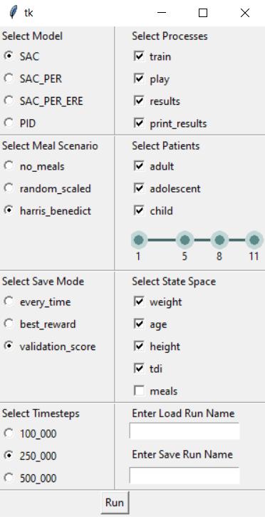

# How to Run
Simply run main.ipynb to load the GUI

# GUI Usage

- Select Model - Choose model. Selecting PID makes choosing the save_mode, timesteps, and state_space irrelevant
- Select Meal Scenario:
  - no_meals - No meals
  - random_scaled - Meal sizes scaled with respect to the patient's body weight
  - harris_benedict - Meal sizes scaled with respect to the Harris Benedict equation that considers the patient's weight, age, and height
- Select Save Mode:
  - every_time - Save every evaluate_every timesteps
  - best_reward - Save every evaluate_every timesteps if the current training reward is a new highest reward
  - validation_score - Run a 3-day simulation on every patient in the validation cohort and save if a new lowest average risk is achieved
- Select Timesteps - Choose number of training timesteps
- Select Processes:
  - train - Train agent using train_SAC.py (or tune PID using tune_PID.py)
  - play - Simulate a scenario with animation
  - results - Gather results for all specified patients
  - print_results - Print various graphs from the gathered results
- Select Patients - The slider bar can be used to select the training, validation, and testing split. The values shown are have a non-inclusive upper bound (as with the range function in python). Slider handles overlap to allow for empty sets
- Select State Space - Choose state space elements
- Enter Load Run Name - Load from a model saved in ./models. Simply provide the filename for the model. Note, the state space cannot be altered as this would change the structure of the neural networks
- Enter Save Run Name - Custom name for model otherwise a default will be set that uses the chosen parameters

Note, other hyperparamers can be manually altered in the hyperparameters.py file - the parameters in the GUI are simply the those that we investigate/change often during our research.

# Code Layout
- ./models - Folder that models save to
- ./results - Folder that model results save to
- ./runs - Folder that model tensorboard runs save to
- ./SAC_RLAP - Folder containg all our code
  - /actor_critic.py - Contains actor and critic modules
  - /evaluate.py - Contains functions for evaluating, playing a simulation, gathering results, and printing results for a model
  - /helpers.py - Contains helper functons for creating the environment with specified parameters, linear normalising, and Clarke and Magni risk indices
  - /hyperparameters.py - Contains our default training, environment, and agent parameters
  - /pid_parameters.csv - Contains the tuned patient-specific PID parameters
  - /replay_buffers - Contains standard, PER, and PER ERE replay buffers
  - /run.py - Compiles and runs the inputs from our GUI to run the selected portions of our code
  - /SACs.py - Contains SAC, SAC_PER and SAC_PER_ERE algorithms all contained as one function
  - /slider_widget.py - Contains custom slider widget with multiple handles for tkinter
  - /train_SAC.py - Runs training loop for a SAC agent
  - /tune_PID.py - Runs tuning loop for a PID controller
- ./simglucose - Folder containg our amended simulator
- ./main.ipynb - Main jupyter notebook file that loads up the GUI for running our code
- ./simglucose_changelog.txt - File containing descriptions of our amendmends to the default simglucose simulator